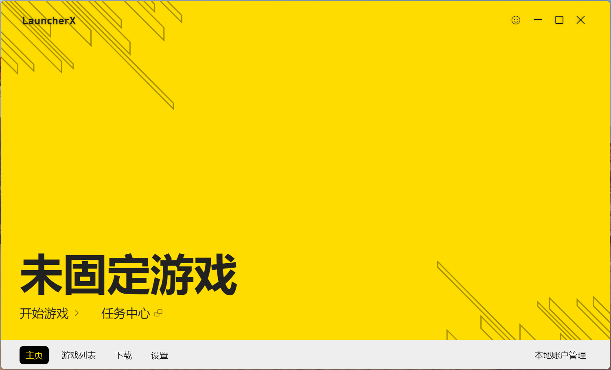
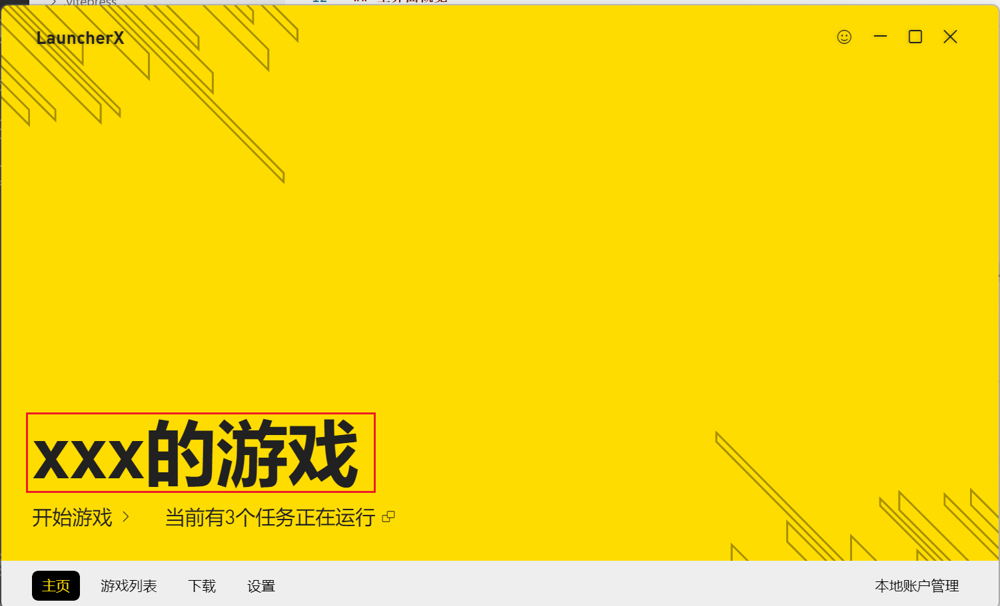
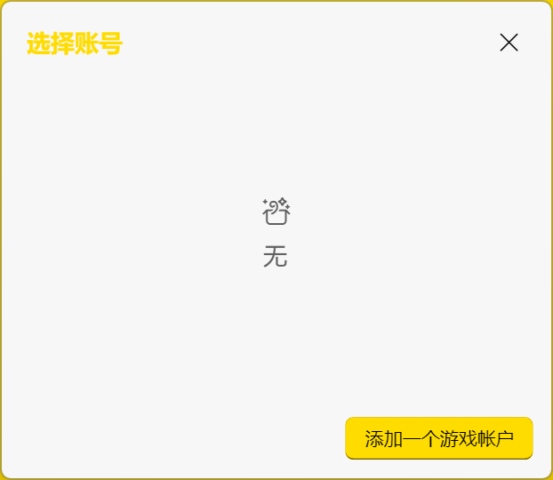

# 主界面

本文主要介绍启动器的主界面的各项功能选项,方便用户快速进行上手操作。

::: info

本文介绍内容以`1.250`版本号为准，操作系统使用`Windows`，请以实际界面为准。

:::

## 主界面概览

*实际情况以应用内为准*

下方分别介绍各个可交互按钮及其功能。

### 笑脸按钮

此按钮包含制作组官方网站链接与联系方式，您可在此处联系我们亦或向我们反馈问题。您亦可在[此处](./../../guide/contact.md)获得我们的联系方式

::: info

关于问题反馈部分，请移步至[此处](./../report-issue.md)获得更详细的解释与说明，本文不再进行详细说明

:::

### 固定实例与开始游戏按钮

点击此区域按钮或开始游戏按钮即可快捷启动预先设置好的实例

::: tip

您需要提前设置好启动实例，否则将会自动跳转到游戏列表界面，并要求您按照指示选择游戏实例

如果您尚未下载游戏，则会弹出以下提醒  
  
此时建议您在下载处进行游戏下载

:::

::: tip

如果您尚未设置您的用户账号，则会弹出弹窗提醒您进行用户设置以正常启动游戏  
  
点击按钮**添加一个游戏帐户**即可进行操作，此内容在[本地账户管理](3_settings_localAccounts.md)处详细讲解。

:::

### 任务中心

点击开始游戏旁边按钮"**任务中心**"即可进入任务中心。在任务中心中，您可以查看启动器正在处理的任务与输出的日志。同时，在下方你也可以查看历史启动器信息输出，这有助于您处理在游戏发生问题。

### 菜单栏

点击白色菜单栏的按钮即可跳转到对应功能页面。

::: tip

由于篇幅有限，您可以点击下面链接跳转到各个功能菜单介绍页面。

* [游戏列表](1_gamelist.md)
* [下载](2_download.md)
* [设置和本地账户](3_settings_localAccounts.md)

:::